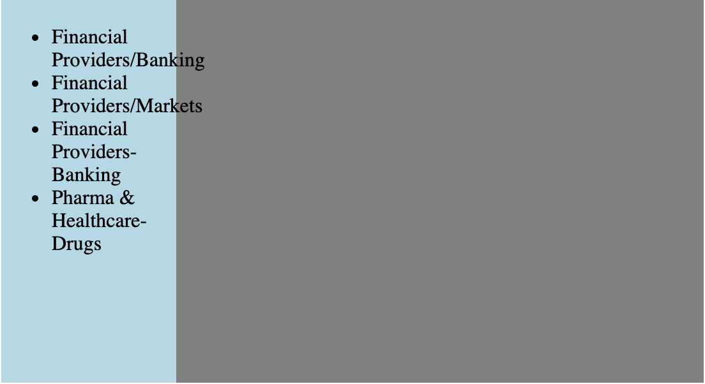

// https://codepen.io/andreaslorozco/pen/oNXQEvO

# ¿Qué es la etiqueta WBR?

Pues no, yo nunca antes la había escuchado. Pero imaginemos el siguiente escenario: Necesitamos presentar una lista de palabras o términos y el ancho de la columna que tenemos para presentarla es limitado.

## El problema

Dependiendo del ancho de la columna y la longitud de los términos, podríamos terminar con este problema ([Código en Codepen](https://codepen.io/andreaslorozco/pen/oNXQEvO)):




En el código tenemos un simple layout de dos columnas, y dentro de la primera columna tenemos una lista no ordenada de términos. Como podemos ver, cuando los términos de nuestra columna estan separados por el caracter `/`, éstos sobrepasan el ancho de la misma e invaden cualquier contenido que tengamos en la siguiente columna. No tenemos este problema con los términos separados por el caracter `-`, pero necesitamos que el quiebre de linea de los primeros términos suceda de manera orgánica.

Gracias a CSS, podríamos pensar en una potencial solución a este problema con la propiedad `word-break`. Esta propiedad tiene dos posibles valores que nos ayudan a hacer quiebres de línea: `break-all` y la propiedad `break-word`. Probemos primero con `break-all`, y asignemosle el valor a los elementos `<li>` ([Código en Codepen](https://codepen.io/andreaslorozco/pen/dyoEyoQ)):  

```css{numberLines: true}

li {
  word-break: break-all;
}
``` 


Y... quedo peor. No solo perdimos el quiebre de linea en el caracter `-`, sino que tambien todos los términos quiebran su línea en el primer caracter que sobrepasaría su columna. ¿Qué tal con `break-word`  ([Código en Codepen](https://codepen.io/andreaslorozco/pen/mdJYdwb)):?

```css{numberLines: true}

li {
  word-break: break-word;
}
``` 


Lastimosamente, `break-word` tampoco nos está solucionando el problema. Recuperamos el quiebre de línea en el caracter  `-`, pero no tenemos control sobre los quiebres de línea de los términos que tienen el caracter `/`. Acá es donde, por fin, entra nuestra etiqueta `<WBR>`.

## La Solución

El elemento HTML <wbr> representa una oportunidad de quiebre de palabra... una posición dentro del texto donde el navegador puede opcionalmente quebrar una linea cuando las reglas regulares no causarían un quiebre en esa posición. Vamos entonces a agregar una etiquta `<wbr>` luego de cada caracter `/`, y eliminemos las reglas de CSS relacionadas a `word-break` ([Código en Codepen](https://codepen.io/andreaslorozco/pen/BaNXmde)):


```html{numberLines: true}

<ul>
  <li>Financial Providers/<wbr>Banking</li>
  <li>Financial Providers/<wbr>Markets</li>
  <li>Financial Providers-Banking</li>
  <li>Pharma & Healthcare-Drugs</li>
</ul>
``` 


## Aprendizaje

Para tener un control un poco más granular de dónde debería quebrar una línea, podemos utilizar el elemento HTML <wbr>. MDN reporta compatibilidad con la mayoría de los navegadores más populares, por lo que es una buenísima opción para adoptar.


##  Enlaces

Te dejo por acá diferentes enlaces que fueron útiles para este post:

*  [WBR en MDN](https://developer.mozilla.org/es/docs/Web/HTML/Elemento/wbr)